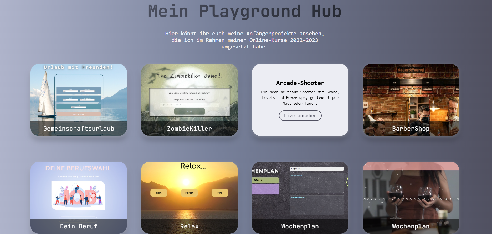

# 🎮 Project Playground Hub

A central showcase for my smaller portfolio projects, presented in an interactive flip card layout. Hover over a card to see the project's description and jump straight to its live demo.

## Live Demo

🔗 [View live](https://vampirenoob.github.io/Playground-Hub/)

## Featured Projects

- 🏖️ **Gemeinschaftsurlaub** – Group vacation cost calculator
- 🧟 **ZombieKiller** – Browser-based shooting game
- 💥 **Neon Blaster** – Arcade-style browser game
- 💈 **BarberShop** – Landing page for a fictional barbershop
- 🎓 **Dein Beruf** – Career orientation quiz
- 🧘 **Relax** – Guided relaxation / meditation page
- 📅 **Wochenplaner** – Weekly meal/task planner
- 🍽️ **Family Recipes** – Recipe collection with baking, main courses, smoothies, and a cooking timer

Each card links to the project's own live demo and GitHub repository.

## Tech Stack

- HTML5 / CSS3
- Vanilla JavaScript
- [GSAP](https://gsap.com/) – Animations
- Custom flip-card layout with full mobile responsiveness

## Note

This hub is a growing collection – new projects are added here as they're completed.

## Contact

Feel free to reach out via GitHub or Instagram:
- GitHub: [@VampireNoob](https://github.com/VampireNoob)
- Instagram: [@vampirenoob](https://www.instagram.com/vampirenoob/)