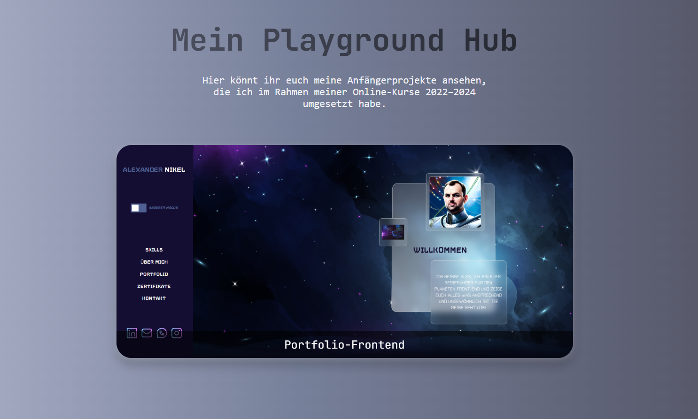

# 🎮 Project Playground Hub

A showcase page linking to my personal frontend portfolio website.

## Live Demo

🔗 [View live](https://vampirenoob.github.io/Playground-Hub/)



## Featured

- Flip-card reveal on hover showing project details
- Links directly to the live portfolio site
- Fully responsive design


## Tech Stack

- HTML5
- CSS3 (Flexbox, 3D Transforms, Media Queries)
- Vanilla JavaScript
- AOS (Animate On Scroll)

## Structure

```
Playground-Hub/
├── index.html
├── style.css
├── script.js
└── images/
├── portfolio-frontend.jpg
├── readme.jpg
└── working.ico
```

## Contact

Feel free to reach out via GitHub or Instagram:
- GitHub: [@VampireNoob](https://github.com/VampireNoob)
- Instagram: [@vampirenoob](https://www.instagram.com/vampirenoob/)